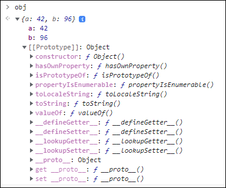
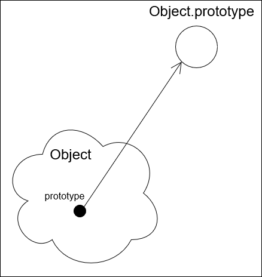

# План

Создадим объект:

```js
const obj = {
    a: 42,
    b: 96
}
```

Для этого объекта мы можем вызвать методы, например, `hasOwnProperty` или `toString`.

```js
console.log(obj.hasOwnProperty());
console.log(obj.toString());
```

Если посмотреть на объект в консоли браузера, то можно увидеть, что кроме свойств, указанных у объекта при его создании, есть ещё целый набор свойств и методов, объединённых в раздел `[[Prototype]]`:




Чтобы понять, что это и откуда взялось, необходимо сделать небольшое отступление:

## Функции-конструкторы

Функции в JavaScript делятся на две категории:
* обычные функции, которые что-либо вычисляют какое-либо значение или изменяют стейт - или и то, и другое одновременно, но это уже говнокод :)
* функции-конструкторы, предназначенные для создания объектов.

Пример функции-конструктора:

```js
const Person = function (name, age) {
    this.name = name;
    this.age = age;
}

const person = new Person('Mark Knopfler', 72);
console.log(person); // --> Person { name: 'Mark Knopfler', age: 72 }
```

Фактически, функция-конструктор служит для создания нового типа:

`функция-конструктор === тип`

## Свойство `Object.prototype

У всех функций-конструкторов встроенных типов JavaScript есть свойство `prototype`, которое содержит ссылку на предопределённый объект (рассмотрим на примере типа `Object`):



Этот объект является хранилищем свойств и методов данного типа.  
Т.к. у этого объекта нет своего имени, его так и называют: `Object.prototype`.

## Отступление: свойство у функции-конструктора???

У _функции_-конструктора есть _свойство_ `prototype` – это как вообще?

Всё (ну ладно, почти всё 🙂) в JavaScript является объектами, в том числе и функции (неважно, обычные или конструкторы). А у любого объекта могут быть свойства и методы:

```js
function sum(a, b) {
    return a + b;
}

sum.description = 'This is a sum of two numbers';
console.log(sum.description); // --> This is a sum of two numbers
```

## Свойство `[[Prototype]]` (`__proto__`)

При создании объекта с помощью функции-конструктора `const obj = new Object(...)` этому объекту автоматически добавляется внутреннее свойство `[[Prototype]]`, в которое копируется значение свойства `prototype` типа `Object`, т.е. ссылка на объект `Object.prototype`:

![`obj.[[Prototype]]`](img/obj_proto.png)

**Примечание 1:** создание объекта с помощью литерала равносильно вызову конструктора: `const obj = {...}` <=> `const obj = new Object(...)`.

**Примечание 2:** под таким именем это свойство фигурирует в спецификации ECMAScript и так же его отображает Google Chrome, Firefox же отображает его как `<prototype>`.

Свойство недоступно для чтения/записи, но для него существует свойство доступа (комбинация геттера и сеттера) `__proto__` (два подчёркивания в начале и в конце).

**Примечание 1:** это свойство реализовано для всех платформ выполнения, т.е. для браузеров и Node.js.

**Примечание 2:** на данный момент это свойство не рекомендуется для использования (является depricated), вместо него нужно использовать пару методов `getPrototypeOf`/`setPrototypeOf`.

**Примечание 3:** хотя язык предоставляет возможность изменения прототипа существующего объекта, эта операция может иметь очень негативные последствия с т.з. производительности, поэтому делать так без крайней необходимости не стоит. Лучше создать копию объекта с нужным прототипом.

Таким образом

```js
console.log(obj.__proto__ === Object.prototype); // --> true
```

## Цепочка наследования

При обращении к свойству или методу объекта исполняющая среда сначала производит поиск этого члена объекта в нём самом. Если обнаружить не удалось, тогда происходит переход к объекту, ссылка на который хранится в `[[Prototype]]`, и поиск происходит в этом объекте. Если же и в нём нет такого члена, тогда происходит переход к его прототипу, и так до тех пор, пока не будет обнаружен искомый метод (или свойство) или пока цепочка прототипов не оборвётся – в `[[Prototype]]` вместо ссылки будет `null`.

Таким образом, при обращении к методу `obj.hasOwnProperty()` произошёл вызов `Object.prototype.hasOwnProperty()`. 

## Свойство `prototype` встроенных типов

Все встроенные ссылочные (объектные) типы JavaScript (`Array`, `String`, `Date`, ...) имеют функцию-конструктор, свойство `prototype` которого ссылается на соответствующий объект-хранилище свойств и методов, поэтому, например, у всех строк есть метод `indexOf`, а у всех массивов – `forEach`.

У этих объектов (`Array.prototype`, `String.prototype`, ...) тоже есть свойство `__proto__`, которое ссылается на `Object.prototype`:


У самого же `Object.prototype` свойство `__proto__` равно `null`.

Таким образом, у всех объектов встроенных ссылочных типов в конце цепочки прототипов находится `Object.prototype` (если, конечно, какие-либо прототипы не изменены вручную).
