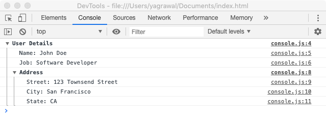
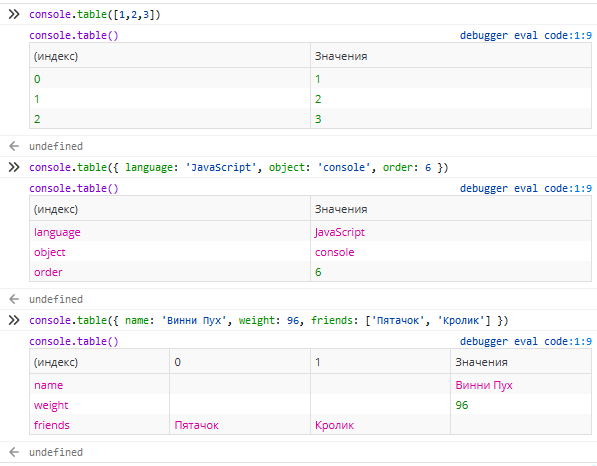

# Объект console

`console.clear()` – очистка консоли

`console.error(текст)` – выводит сообщение красным цветом с красной иконкой  
`console.warn(текст)` – выводит сообщение жёлтым цветом с жёлтой иконкой  
`console.info(текст)` – выводит сообщение с иконкой информации


`console.trace()` – выводит стек вызова

----

`console.count()` – выводит значение счётчика (начиная с 1), при каждом выводе значение инкрементируется


`console.count('counter_name')` – можно использовать несколько независимых именованных счётчиков


----

`console.group('group name')` – начинает группировку, `console.groupCollapsed('group name')` – то же, но группа изначально свёрнута

`console.groupEnd()` – заканчивает группировку; группы могут быть вложенными

Пример:
```javascript
console.group('User Details');
console.log('name: John Doe');
console.log('job: Software Developer');
// Вложенная группа
console.group('Address');
console.log('Street: 123 Townsend Street');
console.log('City: San Francisco');
console.log('State: CA');
console.groupEnd();
console.groupEnd();
```
Результат:



----

`console.table('object')` – выводит объект (в т.ч. массив) в табличном виде



----
`console.time('timer name')` – запускает именованный таймер; может быть запущено сразу несколько разных  
`console.timeEnd('timer name')` – останавливает таймер и выводит длительность работы таймера в милисекундах

----


## TODO:
`debugger` – точка останова (breakpoint)  
`debug('message')` – выводит сообщение в консоль; если передать объект, он преобразуется в строку  
`assert(condition, 'message')` – если `condition === false`, выводит в консоль сообщение  
`dir(object)` – визуализирует объект в консоли  
`dirxml(object)` – визуализирует объект в консоли как XML  
`select(element)` – выбирает элемент в DOM  
`profile('reportName')`, `profileEnd()` – ???
